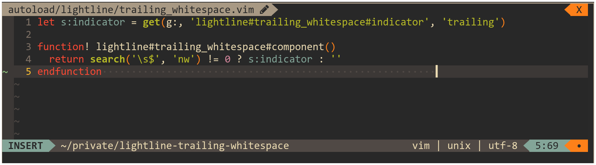

# lightline-trailing-whitespace

This plugin provides indicator for trailing whitespace for the [lightline](https://github.com/itchyny/lightline.vim) vim plugin.



## Table Of Contents

- [Installation](#installation)
- [Integration](#integration)
- [Configuration](#configuration)
- [License](#license)

## Installation

Install using a plugin manager of your choice, for example:

```viml
call dein#add('maximbaz/lightline-trailing-whitespace')
```

## Integration

1. Register the component:

```viml
let g:lightline.component_expand = {'trailing': 'lightline#trailing_whitespace#component'}
```

2. Set color to the component (use `warning` or `error`):

```viml
let g:lightline.component_type = {'trailing': 'error'}
```

3. Add the component to the lightline, for example to the right side:

```viml
let g:lightline.active = { 'right': [[ 'trailing' ]] }
```

## Configuration

##### `g:lightline#trailing_whitespace#indicator`

The indicator to use when there are trailing whitespace. Default is `trailing`.

If you are a fan of unicode characters, here's a good one to use: `•`

## License

Released under the [MIT License](LICENSE)
